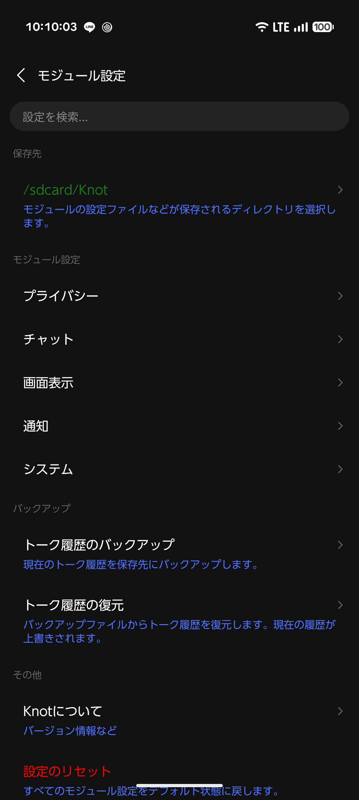
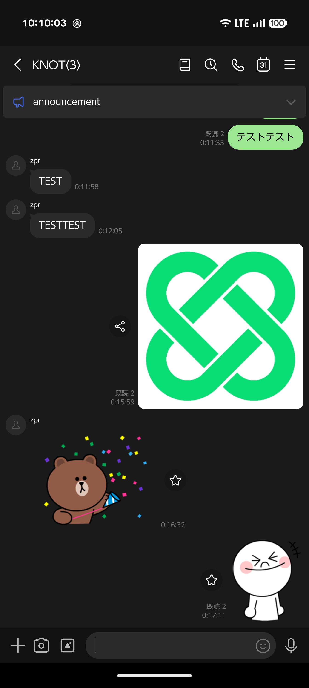
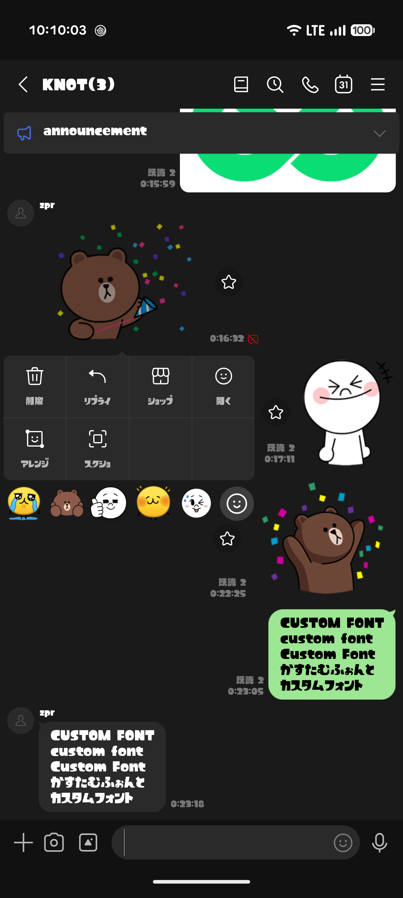
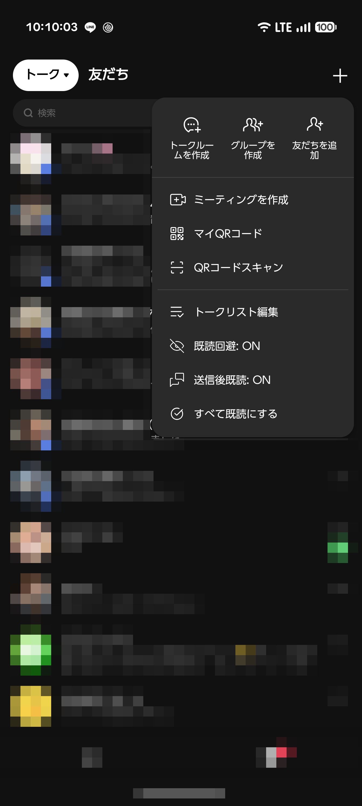
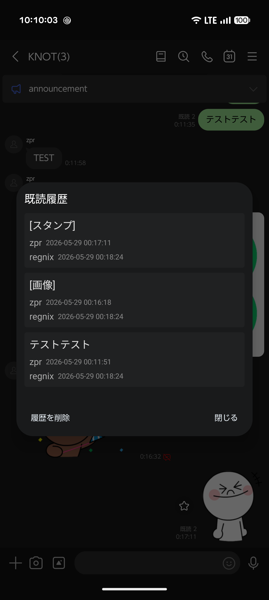
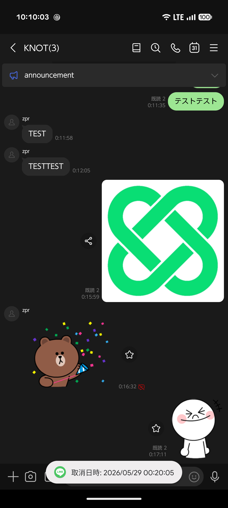

  <h1>
    
    Knot
  </h1>
  
A brand-new Xposed module for LINE

---

**Knot** は、Android版LINEのユーザー体験を向上させるために設計された開発中のXposedモジュールです。

> ⚠️このモジュールは個人が学習目的で開発したものであり、使用は自己責任で行ってください。LINEの利用規約に抵触する可能性があり、このモジュールを使用したことによる不利益について、開発者は一切の責任を負いません。

## スクリーンショット

| 設定画面 | チャット画面 | カスタムフォント |
| :---: | :---: | :---: |
|  |  |  |

| プラスメニュー | 既読履歴 | 送信取り消し防止 |
| :---: | :---: | :---: |
|  |  |  |

## 主な機能

### プライバシー & メッセージ
- **既読回避**: メッセージを既読にせずに読み、返信したい時だけ既読にできます。
- **送信取り消し無効化**: 相手が取り消したメッセージを自分の端末に残し、取消日時の確認も可能にします。
- **既読履歴の記録**: 誰がいつメッセージを読んだかを記録します。
- **送信取り消しの制限延長**: 送信取り消しが可能な時間を24時間まで延長します。
- **URLをデフォルトブラウザで開く**: アプリ内ブラウザではなく、システムのデフォルトブラウザでURLを開きます。
- **AIアイコンを永久に非表示**: チャット画面のAIアイコンを永続的に隠します。

### 画面表示 & UI
- **広告非表示**: トークリストやホーム画面の広告を非表示にします。
- **タブのカスタマイズ**: VOOM、ニュース、MINIなどの不要なタブを個別に非表示にできます。
- **タブラベル非表示**: アイコン下のテキストを消してスッキリとしたレイアウトにします。
- **タブのタップ範囲を拡張**: 下部タブの反応範囲を広げ、操作性を向上させます。
- **ホームの整理**: ホーム画面のおすすめコンテンツやサービス一覧を非表示にできます。
- **不要なボタンの削除**: トークリストの「AI Friends」や「オープンチャット」ボタンを削除します。
- **カスタムフォント**: お好みのTTF/OTFフォントファイルをアプリ全体に適用できます。

### 通知
- **リアクション通知**: メッセージについたリアクションを通知として受け取れます。
- **消音ボタンを非表示**: 通知に表示される「通知をオフ」ボタンを削除します。

## 使い方

1. [Vector](https://github.com/JingMatrix/Vector)または互換性のあるXposed環境をインストールします。
2. [Knot](https://github.com/2b-zipper/Knot/releases/latest)をインストールし、マネージャーでモジュールを有効化します。
3. 対象アプリとして**LINE**を選択します。
4. LINEを再起動し、Knotのモジュール設定から各機能を有効化してください。モジュール設定は、ホームタブ右上の設定ボタンを長押しするか、LINE設定内の追加項目からアクセスできます。

> 非rootユーザーは[NPatch](https://github.com/7723mod/NPatch)の利用を推奨します。

## ライセンス

このプロジェクトは[GNU GPLv3](LICENSE)の下で公開されています。
